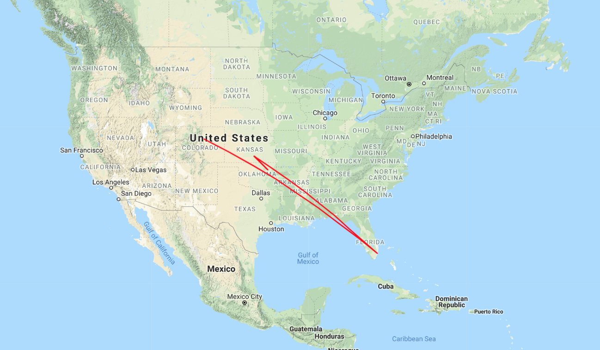

# Traceroute visualization

The `traceroute` utility allows you to see all the network hops a network request makes before arriving at its destination. This is an useful tool for debugging, but it also provides an interesting insight into _physical_ infrastructure - namely, datacenters and the internet backbone.

`main.go` accepts a single host as an argument:

`go run main.go google.com`

And then runs a traceroute of your request. From the output, it plucks the IP addresses, geolocates them with a free API, and then uses the always-handy Google Maps API to render the lines onto a map.

The program then spits out some HTML that is written to `index.html`, which I then view with `php -S localhost:8080` and point my browser to that address.

The results are a not-so great estimation of what the internet background looks like (lukewarm applause)! My hope was that the lines would line up somewhat with the physical infrastructure of the Internet Backbone, but of course the hops are drawn in a straight line, which doesn't correspond to reality. See below hop from Denver-Miami-Kansas City-Oklahoma:

But apparently, google has a datacenter in Pryor, OK, so I learned something new.

Most geolocation APIs are free. Google Map requires a card but there's a free threshold of requests that I don't plan to exceed.

TODO:
- force-directed graph
- lookup IP initially and start rendering draw from there
- center map on the initial lookup
